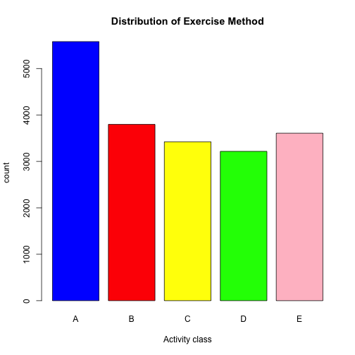

# Synopsis
Using data from accelerometers on the belt, forearm, arm, and dumbell of 6 participants who were asked to perform barbell lifts correctly and incorrectly in 5 different ways, we will predict the manner in which they did the exercise.


# Getting the data

```r
#training data
download.file("https://d396qusza40orc.cloudfront.net/predmachlearn/pml-training.csv", "training.csv", method = "curl")
#test data
download.file("https://d396qusza40orc.cloudfront.net/predmachlearn/pml-testing.csv", "testing.csv", method = "curl")
train <- read.csv("training.csv")
test <- read.csv("testing.csv")
```

# Exploring the data

```r
dim(train)
```

```
## [1] 19622   160
```

```r
dim(test)
```

```
## [1]  20 160
```

```r
differing <- match(FALSE,(names(test) == names(train)))
names(train)[differing]
```

```
## [1] "classe"
```

```r
names(test)[differing]
```

```
## [1] "problem_id"
```

```r
plot(train$classe, xlab="Activity class", ylab="count", main="Distribution of Exercise Method", col=c("blue","red","yellow","green","pink"))
```

 

We see that both the test and training data sets have the same column dimensions, with only the last column differing in name. For our training data set the last column is the "classe" variable, which is the variable that predicts the manner in which the participants do excercise. From the dataset documentation, we get that five different fashions of activity are: exactly according to the specification (Class A), throwing the elbows to the front (Class B), lifting the dumbbell only halfway (Class C), lowering the dumbbell only halfway (Class D) and throwing the hips to the front (Class E). For our testing set the last column is a problem id.

In the plot, we can see that most activities are classified in class "A", which is performing the activity exactly as specified. 

# Cleaning the data

```r
#NAs in training set
naTrain <- sum(is.na(train))
#NA percentage in training set
percentNATrain <- sum(is.na(train))/ (dim(train)[1] * dim(train)[2])
#NAs in test set
naTest <- sum(is.na(test))
#NA percentage in test set
percentNATest <- sum(is.na(test))/ (dim(test)[1] * dim(test)[2])
```

From the commands above, we see that there are 1287472 NAs in the training set and 2000 in the test test, which amount to 0.4100856% and 0.625% respectively. If there are columns of completely NA values in any of the data sets, we will remove them from both.


```r
# completly NA columns in training set
sum(colSums(is.na(train)) == nrow(train))
```

```
## [1] 0
```

```r
# completly NA columns in test set
sum(colSums(is.na(test)) == nrow(test))
```

```
## [1] 100
```

```r
# keep columns that are not all NA in both
keepCol <- (colSums(is.na(train)) < nrow(train)) & (colSums(is.na(test)) < nrow(test))
train <- train[,keepCol]
test <- test[,keepCol]
dim(train)
```

```
## [1] 19622    60
```

```r
dim(test)
```

```
## [1] 20 60
```

# Cross Validation
One of the reasons we use cross validation is for picking what type of prediction function to use by comparing different predictors. In this case we are going to compare for the following algorithms:
* Recursive Partitioning (Trees)
* Random Forests
* GBM (Gradient Boosting Machine) (Boosting with Trees)
* Linear Discriminate Analysis
* Naive Bayes

We will set k=5 for our K-folds cross validation, one for each of our algorithms above.

```r
set.seed(123)
# prediction algorithms
algorithms <- c("rpart","rf","gbm","lda","nb")
k <- length(algorithms)
folds <- createFolds(y=train$classe, k=k, list = TRUE)
sapply(folds,length)
```

```
## Fold1 Fold2 Fold3 Fold4 Fold5 
##  3925  3924  3925  3925  3923
```

# Training with PCA Preprocessing
We have 59 variables to predict with in the data set, which is a really big number. We might not need every predictor, a weighted combination might be beter. For this reason we will be preprocessing with Principle Component Analysis, which will pick the combination that captures the most information possible and will reduce the noise.

```r
# empty vector to enter models
models <- vector(length = k)
# empty vector for accuracy
accuracy <- vector(length = k)
for(i in 1:k){
    trainSub <- train[-folds[[i]],]
    testSub <- train[folds[[i]],]
    algorithms[i]
    modFit <- train(as.factor(classe) ~. , data=trainSub, method=algorithms[i], preProcess = "pca", na.action = na.omit)
    models[i] <- modFit
    pred <- predict(modFit,testSub)
    accuracy[i] <- confusionMatrix(pred,testSub$classe)$overall['Accuracy']
}
```

# Choosing a prediction function
Now that we have predicted with all our models, we will take a look at the accuracy and see which has the largest one. 

```r
cbind(algorithms,accuracy)
```

```
##      algorithms accuracy           
## [1,] "rpart"    "0.284331210191083"
## [2,] "rf"       "0.993119266055046"
## [3,] "gbm"      "0.944713375796178"
## [4,] "lda"      "0.830063694267516"
## [5,] "nb"       "0.815702268671935"
```

```r
max(accuracy)
```

```
## [1] 0.9931193
```

```r
models[[match(max(accuracy),accuracy)]]
```

```
## [1] "rf"
```
We can see that the random forest method gave the highest accuracy with 99.3%, while recursive partitioning gave the lowest with 28.4%. This was defiinitely an outlier, given that the other 4 methods were above 81.5%. Given the results above, we will use the random forest model on the test data.


```r
# select the model with highest accuracy
predictionFunction <- models[match(max(accuracy),accuracy)]
# predict using model
results <- predict(predictionFunction,test)
```

# Sample and Out of Sample Error
We know the accuracy from above, so let's calculate the sample error below.

```r
1 - max(accuracy)
```

```
## [1] 0.006880734
```

The out of sample error is always larger that the sample error, so we can easily estimate that the out of sample error will be larger than 0.6%.

The resulting predictions for the 20 test values were:


```r
results
```

```
##  [1] B A A A A E D B A A B A B A E E A B B B
## Levels: A B C D E
```

After submitting to prediction assignment part of the project, 18/20 we're correct. Specifically values in indices 3 and 12 were wrong. This gives us 90 % accuracy.
